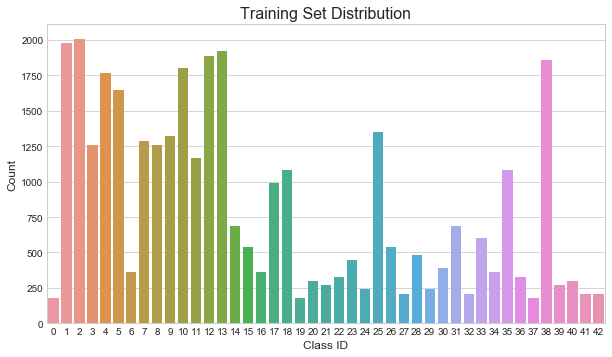

# **Traffic Sign Recognition** 

## Writeup

### You can use this file as a template for your writeup if you want to submit it as a markdown file, but feel free to use some other method and submit a pdf if you prefer.

---

**Build a Traffic Sign Recognition Project**

The goals / steps of this project are the following:
* Load the data set (see below for links to the project data set)
* Explore, summarize and visualize the data set
* Design, train and test a model architecture
* Use the model to make predictions on new images
* Analyze the softmax probabilities of the new images
* Summarize the results with a written report

[//]: # (Image References)

[image1]: ./examples/visualization.jpg "Visualization"
[image2]: ./examples/grayscale.jpg "Grayscaling"
[image3]: ./examples/random_noise.jpg "Random Noise"
[image4]: ./examples/placeholder.png "Traffic Sign 1"
[image5]: ./examples/placeholder.png "Traffic Sign 2"
[image6]: ./examples/placeholder.png "Traffic Sign 3"
[image7]: ./examples/placeholder.png "Traffic Sign 4"
[image8]: ./examples/placeholder.png "Traffic Sign 5"

## Rubric Points
### Here I will consider the [rubric points](https://review.udacity.com/#!/rubrics/481/view) individually and describe how I addressed each point in my implementation.  

---
### Writeup / README

#### 1. Provide a Writeup / README that includes all the rubric points and how you addressed each one. You can submit your writeup as markdown or pdf. You can use this template as a guide for writing the report. The submission includes the project code.

Here is the link to the [code](https://github.com/lcyyork/CarND-Traffic-Sign-Classifier-Project/blob/master/Traffic_Sign_Classifier.ipynb).
The exported HTML version locates in the current directory with a name *Traffic_Sign_Classifier.html*.

### Data Set Summary & Exploration

#### 1. Provide a basic summary of the data set. In the code, the analysis should be done using python, numpy and/or pandas methods rather than hardcoding results manually.

I used `numpy` to figure out the following statistics:

* The size of training set is 34799.
* The size of the validation set is 4410.
* The size of test set is 12630.
* The shape of a traffic sign image is (32, 32, 3).
* The number of unique classes/labels in the data set is 43.

The `pandas` library is employed to read the csv file that contains the description of each class ID.
To plot the figure, I chose the `seaborn` plotting style.

#### 2. Include an exploratory visualization of the dataset.

The data sets given have the following distributions, shown in histograms.

Clearly, different classes are not evenly distributed, which is not a problem as long as this agrees with real-world frequencies of the signs.
The distribution of validation set is slightly different from the training set, which is potentially be a problem as the hyperparameter tunings are comparing apples to oranges.

### Design and Test a Model Architecture

#### 1. Describe how you preprocessed the image data. What techniques were chosen and why did you choose these techniques? Consider including images showing the output of each preprocessing technique. Pre-processing refers to techniques such as converting to grayscale, normalization, etc. (OPTIONAL: As described in the "Stand Out Suggestions" part of the rubric, if you generated additional data for training, describe why you decided to generate additional data, how you generated the data, and provide example images of the additional data. Then describe the characteristics of the augmented training set like number of images in the set, number of images for each class, etc.)

To begin with, I directly feed the RGB images to model.
The performance is good, but increasing the number of features notably slow down the training process.
As such, I decide to use gray-scaled images to speed up.
The gray-scale formula I used is `0.299 * R + 0.587 * G + 0.114 * B`.

I tried two quick-and-dirty ways to normalize the initial images.
One is `(pixel - 128) / 128` and the other is `pixel / 255`.
The first approach moves the mean roughly to 0 and the second moves it roughly to 0.5.
Both approaches work well but the first scheme slightly outperforms the second one.

To avoid uneven distribution between training and validation sets, I combined the training and validation sets and reshuffle them using the `train_test_split` function from `sklearn.model_selection`.
In fact, I not only redistrubuted the training and validation sets, but also augmented the data set by slightly moving, rotating, shearing, and enlarging the images.
These operations were done using `OpenCV` and I followed [this online tutorial](http://opencv-python-tutroals.readthedocs.io/en/latest/py_tutorials/py_imgproc/py_geometric_transformations/py_geometric_transformations.html).
The moving, rotating, shearing, and enlarging are useful because in real-world applications, a sign may not be centered in an image and the picture can possibly be token from different perspective angles.
Adding these data should make the model more robust to the translational and perspective changes.

Adding more data for training is generally believed to yield better neural networks.
However, instead of taking thousands of new pictures in person or crawling the internet, it is easier to manipulate some of the images available (data augmentation).
In general, as long as the augmented data look real, the training should be OK.

With the data augmentation and redistribution, the training and validation examples grow to 37640 and 9410, respectively.
The new distributions are shown below. Now training and validation sets seem to have the same distributions.

#### 2. Describe what your final model architecture looks like including model type, layers, layer sizes, connectivity, etc.) Consider including a diagram and/or table describing the final model.

My final model consisted of the following layers:

| Layer         		|     Description	        					| 
|:---------------------:|:---------------------------------------------:| 
| Input         		| 32x32x1 gray image   							| 
| Convolution 5x5     	| 1x1 stride, valid padding, outputs 28x28x12 	|
| RELU					|												|
| Max pooling 1     	| 2x2 stride, outputs 14x14x12 				    |
| Max pooling 1.5      	| 2x2 stride, outputs 7x7x12    				|
| Convolution 5x5	    | 1x1 stride, valid padding, outputs 10x10x20   |
| RELU					|												|
| Max pooling 2      	| 2x2 stride, outputs 5x5x20    				|
| Flatten pool 1.5 and 2| inputs 14x14x12 + 5x5x20, outputs 1088        |
| Fully connected		| RELU, outputs 120       						|
| Softmax				| outputs 43       								|
 

#### 3. Describe how you trained your model. The discussion can include the type of optimizer, the batch size, number of epochs and any hyperparameters such as learning rate.

I used Xavier initializer, which keep the scale of the gradients roughly the same in all layers.

The Adam optimizer is chosen, which combines gradient decent with momentum and RMSProp techniques.
It performs better than the straightforward gradient decent.

Since I trained the model on my laptop, I tried to have a combination of hyperparameters that make the model converge as fast as possible.
Training speed is not the first concern in general, but the accuracy.
Next time I might try to use the AWS machines.

Learning rate was set to 0.002 with exponential decay (decay rate = 0.99).
Both 0.001 and 0.002 provide similar answers in 10 epochs.
For the sake of computational power I have, I decided to use 0.002.

For regularization, I chose dropout with keep-probability 0.65 and without L2 regularization.
Invoking L2 regularization seems to begin the model in an inferior starting point, and I am not sure if the process can roughly be converged in very few numbers of iterations.

The batch size was set to 128, although 64 and 193 yield similar results.

For the final run, the model was trained for 41 epochs.
The cost function was roughly converged within 25 epochs and started to oscillate.

#### 4. Describe the approach taken for finding a solution and getting the validation set accuracy to be at least 0.93. Include in the discussion the results on the training, validation and test sets and where in the code these were calculated. Your approach may have been an iterative process, in which case, outline the steps you took to get to the final solution and why you chose those steps. Perhaps your solution involved an already well known implementation or architecture. In this case, discuss why you think the architecture is suitable for the current problem.

My final model results were:
* training set accuracy of 99.2 %.
* validation set accuracy of 97.0 %. 
* test set accuracy of 94.1 %.

Given the Bayes error is about 0 %, the training error is only 0.8 %.
The validation error is 3 %, much larger than 0.8 %, suggesting the model is overfitting.
A good practice is to look at the falsely assigned examples in the validation sets and decide what to tune next.
However, this step is not done here.
The test accuracy is 94.1 %, which is acceptable.

I made a few changes to the two established architectures: LeNet-5 and [multi-scale convolutional networks](http://yann.lecun.com/exdb/publis/pdf/sermanet-ijcnn-11.pdf).
The well-known LeNet-5 is firstly applied to recognizing hand-written numbers.
The multi-scale method is used to classify traffic signs (see above link for the paper by Sermanet and LeCun).
The number of hidden units in the last fully connected layer before softmax is very similar to the previous layer.
I thus deleted this layer and called the model "LeNet-4".

To start with, I tried the orignal LeNet-5, the LeNet-4, the multi-scale LeNet-5 and multi-scale LeNet4.
Results on RGB images show that multi-scale LeNet4 gives the best validation accuracy in 6 epochs.

The original depths of covolution layers in LeNet-5 performs OK but increasing the number of features gives better results in small numbers of epochs.
The multi-scale paper reports several combinations of feature numbers in the first two convolution layers.
I tried the smallest one (22 of layer 1 and 38 of layer 2), which yields the best results in 6 epochs.
However, this is too slow to train on my laptop.
Then I decided to compensate with 12 features of layer 1 and 20 features of layer 2, which is still larger than the original LeNet-5 convolution layers.

The hyperparameter tunings are explained in the code.
 

### Test a Model on New Images

#### 1. Choose five German traffic signs found on the web and provide them in the report. For each image, discuss what quality or qualities might be difficult to classify.

I found ten German traffic signs on the web and I cropped them to square in advance.
Then I used `OpenCV` to downscale them to 32 by 32.

Here are five of them.

The first three images are wrongly classified by the model, and they are difficult examples.
For the "Wild animals crossing" sign, the direction of the deer is reversed comparing to the normal sign.
The background of "Speed 80 km/h" is rather noisy, and so does the "Roundabout" sign.
The "Roundabout" class does not have lots of training examples (< 250 in non-augmented data), which could be the weakness of the model.

#### 2. Discuss the model's predictions on these new traffic signs and compare the results to predicting on the test set. At a minimum, discuss what the predictions were, the accuracy on these new predictions, and compare the accuracy to the accuracy on the test set (OPTIONAL: Discuss the results in more detail as described in the "Stand Out Suggestions" part of the rubric).

Here are the results of the prediction:

| Image			        |     Prediction	        					| 
|:---------------------:|:---------------------------------------------:| 
| Wild animals crossing | Bicycles crossing  							| 
| Roundabout mandatory  | Speed limit (100km/h)							|
| Speed limit (80km/h)	| Go straight or right  						|
| No entry              | No entry  					 				|
| Priority road         | Priority road      							|
| Road work             | Road work         							|
| Children crossing     | Children crossing 							|
| Speed limit (30km/h)  | Speed limit (30km/h)  						|
| Stop sign             | Stop              							|
| Ahead only            | Ahead only        							|

The model was able to correctly guess 7 of the 10 traffic signs, which gives an accuracy of 70%.
This value is way inferior to the accuracy on the test set (94.1 %), mainly because the deliberately chosen images.

#### 3. Describe how certain the model is when predicting on each of the five new images by looking at the softmax probabilities for each prediction. Provide the top 5 softmax probabilities for each image along with the sign type of each probability. (OPTIONAL: as described in the "Stand Out Suggestions" part of the rubric, visualizations can also be provided such as bar charts)

The code for making predictions on my final model is located in the 32nd cell of the Ipython notebook.

Here I only show the falsely assigned images, because the remainders' top picks are all 100 %.

For the "Wild animals crossing"sign, the top five soft max probabilities are:

| Probability         	|     Prediction	        					| 
|:---------------------:|:---------------------------------------------:| 
|1.00         			| Bicycles crossing								| 
| .00     				| Dangerous curve to the right					|
| .00					| Wild animals crossing  						|
| .00	      			| Beware of ice/snow			 				|
| .00				    | Road work          							|

For the "Roundabout" image, the top five picks are:

| Probability         	|     Prediction	        					| 
|:---------------------:|:---------------------------------------------:| 
| .66         			| Speed limit (100km/h) 						| 
| .29     				| Roundabout mandatory      					|
| .05					| Priority road         						|
| .00	      			| Speed limit (80km/h)			 				|
| .00				    | Speed limit (50km/h)							|

For the "Speed limit (80km/h)" sign, the top five picks are

| Probability         	|     Prediction	        					| 
|:---------------------:|:---------------------------------------------:| 
| .47         			| Go straight or right   						| 
| .19     				| Keep right                					|
| .17					| Yield                 						|
| .11	      			| Turn left ahead   			 				|
| .07				    | Turn right ahead   							|

### (Optional) Visualizing the Neural Network (See Step 4 of the Ipython notebook for more details)
#### 1. Discuss the visual output of your trained network's feature maps. What characteristics did the neural network use to make classifications?

Since gray-scaled images are used for training, the model is not very sensitive to colors.
And to my bare eyes, sometimes the red and blue are not clearly distinguished under gray scale.
The classifier mainly identify the lines and shapes.
Even for the wrongly assigned examples, the shapes of the signs are actually correct.
From the feature maps of the "Roundabout" sign, we see the first convolution layer shows circles and tilted circles.
The second layer is only 5 by 5 and I cannot figure out any pattern.
However, note that the "Roundabout" sign does have some features in common with the "Speed limit (100km/h)" sign.
For instance, features 10 and 18 in layer 2 and circle shapes in layer 1.
